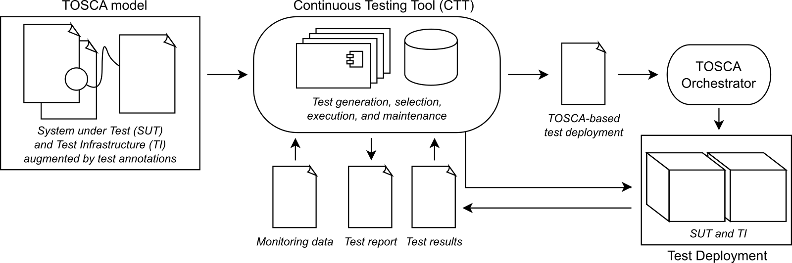

A user defines tests by adding them to a TOSCA service template for the application under test. We have extended the set of TOSCA node types, relationship types, and policy types for expressing different types of tests and including suitable test drivers. For instance, CTT allows the definition of a load test to be executed using a configured load driver such as `JMeter <https://jmeter.apache.org/>`_. After being deployed by a TOSCA orchestrator such as `xOpera <https://github.com/xlab-si/xopera-opera>`_, the tests are executed and the test results are made available to the user. 

Via its REST-based interface, users can execute the continuous testing on-demand or include it as a part of the CI/CD process. CTT is designed as an extensible framework that allows the definition of new test types, metrics, and tools. CTT is publicly available under the `Apache License 2.0 <http://www.apache.org/licenses/>`_ open-source license. CTT will integrate and extend parts of the `ContinuITy <https://continuity-project.github.io/>`_ approach and tools for performance testing in continuous software engineering.

The following figure shows the workflow of the CTT tool. 

The following video provides a 5-minute demo.

.. raw:: html

   <iframe width="560" height="315" src="https://www.youtube.com/embed/35VN2edyvsc" frameborder="0" allow="accelerometer; autoplay; encrypted-media; gyroscope; picture-in-picture" allowfullscreen></iframe>

